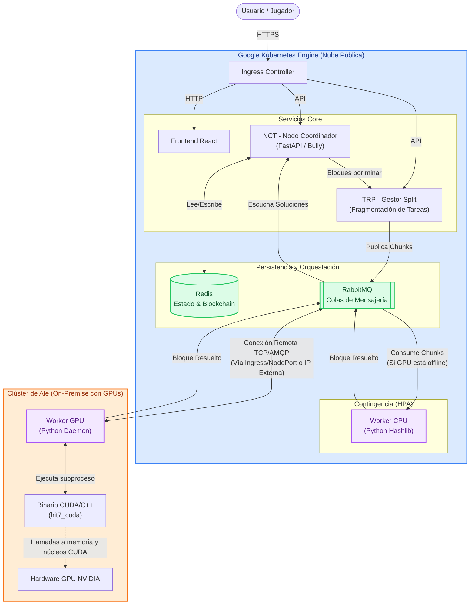

# Diagrama de Arquitectura Híbrida: StickerChain

El sistema StickerChain utiliza una arquitectura distribuida que abarca dos entornos distintos: **GKE (Google Kubernetes Engine)** en la nube y el **Clúster de Ale** (un clúster on-premise/Edge, típicamente K3s) equipado con hardware gráfico para cómputo de alto rendimiento.

## 1. Topología y Separación de Clústeres

### GKE (Nube Pública)
Este clúster aloja todos los servicios *core*, bases de datos, orquestación de colas y minería de contingencia (CPU). Todo se despliega vía OpenTofu/GitHub Actions.
- **Frontend (React/Vite)**: Interfaz de usuario servida a los jugadores.
- **NCT (Nodo Coordinador / Oráculo)**: El cerebro del sistema (FastAPI). Gestiona la blockchain, las wallets, la dificultad dinámica y consolida los bloques resueltos.
- **TRP (Pool de Transacciones / Gestor Split)**: Divide el inmenso espacio de búsqueda (nonces) en *chunks* pequeños y los publica constantemente en el broker de mensajería.
- **Worker CPU (Fallback)**: Mineros escritos en Python nativo. Solo procesan *chunks* si el Gestor Split detecta que no hay mineros GPU conectados, o escalan automáticamente usando un HPA de Kubernetes si el consumo de CPU supera el 80%.
- **RabbitMQ**: Broker de mensajería. Mantiene la cola de trabajo (`tareas_mineria`) y recibe las soluciones (`solved_blocks`).
- **Redis**: Base de datos en memoria para la persistencia rápida del estado y la Blockchain.

### Clúster de Ale (On-Premise / Edge con GPUs)
Este clúster externo está físicamente separado y especializado en resolver el problema criptográfico (Proof of Work) de la forma más rápida posible usando fuerza bruta paralela.
- **Worker GPU**: Pods que cuentan con una tolerancia especial (`nvidia.com/gpu: NoSchedule`) para ejecutarse en los nodos con placas de video.
- **Conexión Externa**: Estos pods no procesan mensajería local, sino que se conectan de forma remota y autenticada al RabbitMQ que vive en el clúster de GKE.
- **Binario CUDA/C++**: El Worker invoca el programa pre-compilado que aprovecha la arquitectura paralela masiva de la GPU para calcular millones de hashes por segundo.

---

## 2. Diagrama de Arquitectura (Mermaid)

## 3. Flujo de Comunicación Híbrida

El desacoplamiento es posible gracias al modelo publicador/suscriptor a través de **RabbitMQ**:
1. Las operaciones críticas de negocio (*validar transacciones, actualizar álbumes*) se mantienen resguardadas en la infraestructura *cloud-native* de **GKE**.
2. Cuando el bloque está listo para minarse, el nodo coordinador (NCT) se lo pasa al gestor split (TRP), quien lo fragmenta en billones de nonces.
3. El clúster local (**Clúster de Ale**) funciona únicamente como una *granja de render/cómputo*. Extrae los chunks de la cola pública en GKE, los procesa a máxima velocidad usando la GPU, y devuelve el nonce exitoso a la cola de resultados.
4. GKE (específicamente el NCT) retoma la aserción final, validando matemáticamente la prueba de trabajo antes de guardarlo de forma definitiva en Redis.
